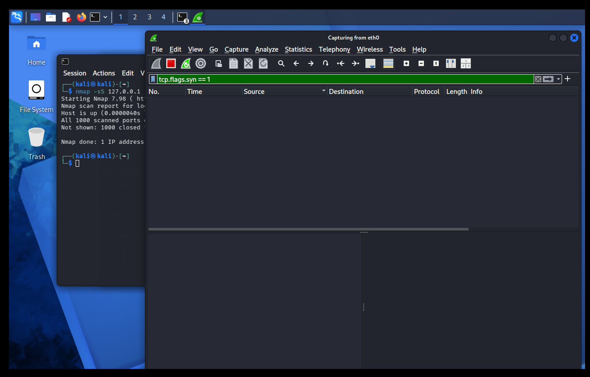
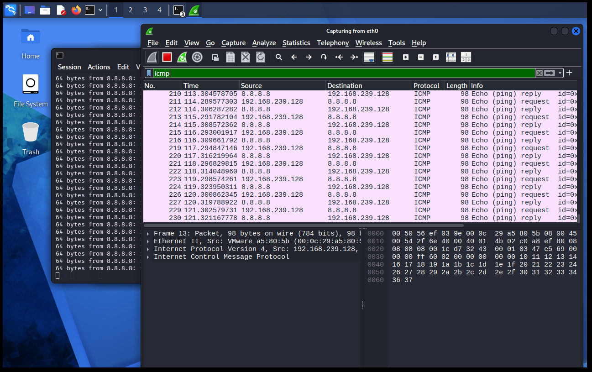

# SOC Analyst Simulation: Network Traffic Analysis

## Overview
This project simulates a Security Operations Center (SOC) analyst monitoring and analyzing live network traffic in a controlled lab environment. Traffic was generated and captured using Kali Linux and Wireshark, then analyzed to understand protocol behavior and communication patterns.

## Tools Used
- Wireshark
- Kali Linux
- ICMP (Ping traffic generation)

## Lab Environment
- Platform: VMware Workstation Pro
- System: Kali Linux VM
- Network Mode: NAT

## Scenario Summary
ICMP traffic was generated using a continuous ping to an external host (8.8.8.8). Wireshark was used to capture and filter this traffic, allowing analysis of packet structure, communication flow, and protocol behavior.

## Skills Demonstrated
- Network traffic capture
- Packet filtering (Wireshark display filters)
- Protocol analysis (ICMP)
- Source and destination identification
- Packet inspection
- Security-focused documentation

## Key Findings
- Source IP: 192.168.239.128
- Destination IP: 8.8.8.8
- Protocol: ICMP
- Activity: Continuous echo request/reply communication
- Detection Method: Wireshark capture with ICMP filter
- Conclusion: Observed traffic was consistent with normal network connectivity testing

## Project Structure
soc-analyst-simulation-port-scan/
├── README.md
├── scenario/
├── investigation/
├── evidence/
│ └── screenshots/
├── detection/
└── lessons-learned.md

## Screenshots

### Traffic Capture

### ICMP Analysis

## Conclusion
This project demonstrates foundational SOC analyst skills, including capturing live traffic, filtering relevant data, and analyzing packet-level communication. Understanding normal network behavior is essential for identifying anomalies in real-world security operations.

---